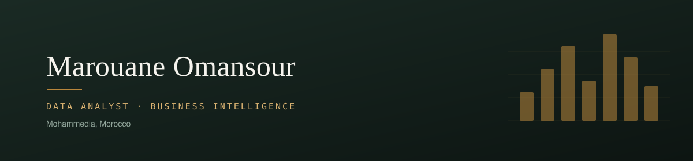

  

  
<em>Turning large, messy datasets into dashboards and decisions people actually act on.</em>

## About

Data analyst specializing in business intelligence: data modeling, advanced SQL, and Power BI dashboards built to hold up under real use, not just to look good in a demo. My background is research-heavy data science at the postgraduate level, and it shows in how I approach a dataset: check assumptions, quantify the finding, then build something a non-technical stakeholder can actually act on.

## Education

**MSc Data Science and Analytics (Distinction), Royal Holloway, University of London**
Awarded Best MSc Student, Department of Computer Science. Thesis on conformal prediction for hierarchical multi-class classification, with coverage guarantees validated across 225,000+ image classifications.

**BSc Software Engineering (First-Class Honours), Cardiff Metropolitan University**

## Currently

Preparing for the PL-300 (Microsoft Power BI Data Analyst) certification and deepening my work with Microsoft Fabric, alongside a self-directed capstone applying pandas and Power BI to a new dataset end to end.

## Skills

| | |
|---|---|
| **Business Intelligence** | Power BI (Desktop, Service), DAX, Power Query (M), star schema modeling, dashboard design |
| **Data & SQL** | SQL, relational modeling, normalization (3NF), CTEs, window functions |
| **Programming** | Python (pandas, NumPy) |
| **Tools** | Advanced Excel, Git |

## Projects

**[E-Shop Power BI Dashboard](https://github.com/AppaYiipYiip/Eshop-PowerBi)**
A 4-page Power BI dashboard (executive summary, sales, web analytics, KPIs) for a fictional e-commerce business. Star schema with 2 fact tables and 4 dimensions, DAX measures for revenue and engagement, and Power Query cleaning with interactive period and region segments.

**[Twitter Database Normalization and SQL Analysis](https://github.com/AppaYiipYiip/Twitter-SQL-Analysis)**
Rebuilt a denormalized dataset of about 100,000 tweets into a proper 3NF schema, then wrote analytical queries (CTEs, window functions, subqueries) to study user behavior. Found strong language homophily: 86% of replies stayed in the same language as the original post, against 48% expected by chance.

**[Enron Email Network Analysis](https://github.com/AppaYiipYiip/Enron-Email-Network-Analysis)**
Processed 500,000+ emails with Apache Spark to reconstruct an organization's internal communication network. Found that 20% of employees accounted for over 90% of all exchanges, with results delivered as visualizations built for non-technical stakeholders.

## Certifications

Google Project Management Professional Certificate (2025). AWS Cloud Practitioner, in progress (2026).

## Get in touch

  <a href="mailto:marwanomansour04@gmail.com">marwanomansour04@gmail.com</a> &nbsp;&#183;&nbsp; <a href="https://www.linkedin.com/in/marouane-omansour">LinkedIn</a>

